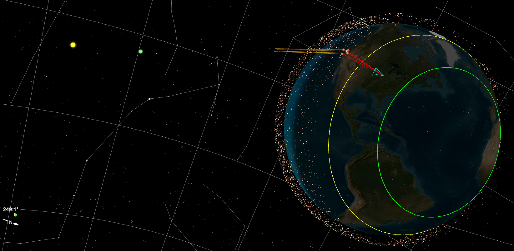
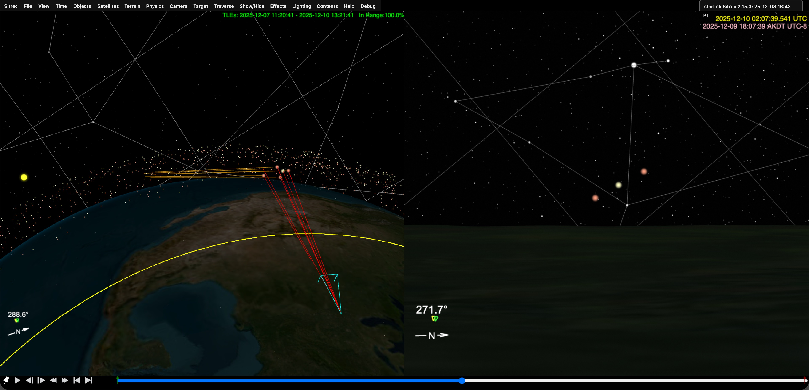
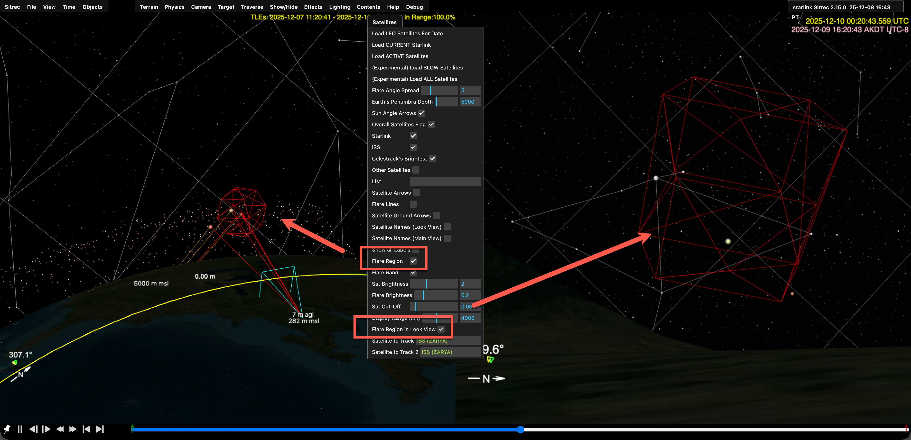
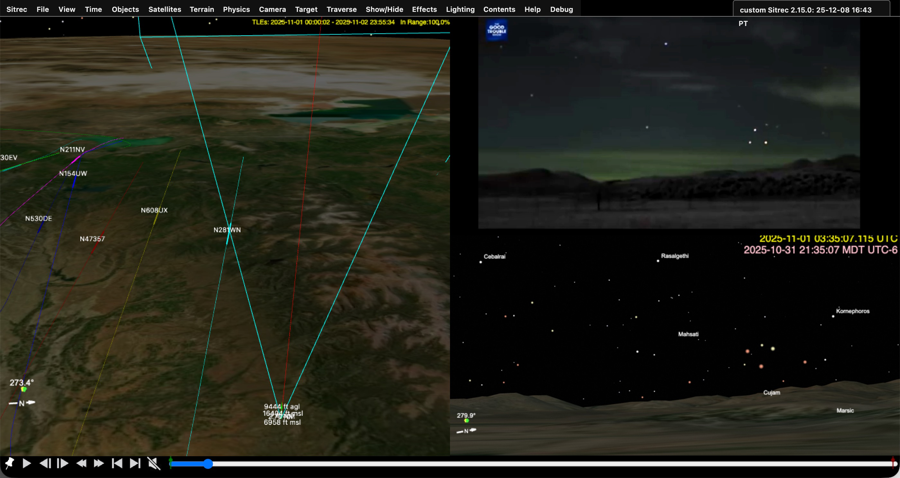

# Investigating Starlink Flares With Sitrec

Starlink satellites form a huge constellation that covers the globe at altitudes of around 550 km. As of late 2025, there are approximately 10,000 of them in orbit. It's possible this will increase to 20,000 over the next few years. 

Satellites are visible when it's dark, and the satellite is illuminated by the sun. With Starlink satellites, this happens in one of three ways. 

1 - Launch train overhead passes

The most noticeable sighting. A line of bright dots traverses the sky. These are satellites shortly after launch (in a "train" formation), at lower altitudes, and not aligned to prevent reflections.  

2 - Deployed overhead passes ("typical" satellites)

Like many satellites, Starlink satellites can be seen when close to the observer about an hour or two after sunset or before sunrise. This will be a dim moving dot that may appear or vanish as it emerges from or enters the Earth's shadow. These are not particularly notable, and the small size of Starlink satellites makes them relatively insignificant. 

3 - Deployed Horizon Flares

The antenna on a Starlink satellite is a flat panel aligned horizontally. When the satellite is low in the sky, near the horizon, the flat panel can briefly reflect sunlight, appearing as a bright dot that moves in a straight line for a few seconds (typically 5-20 seconds) before fading out. 

While Sitrec can simulate all three, the horizon flares are most commonly mistaken for UAP. They look very different from the trains or typical satellite passes people are familiar with. A large number of them, as many as ten,  can appear simultaneously in the same patch of sky (directly above where the sun is). They can be surprisingly bright (as bright as Venus) and visible even with significant light pollution. The criss-crossing trajectories of the Starlink constellation combine with the short duration of appearance to give the illusion of a smaller number of objects that change direction, even seeming to fly in racetrack patterns or dog-fight each other. 

So we'll focus here on Starlink Horizon Flares. 

The following discussion assumes the use of the Metabunk.org installation of Sitrec. URLs and some menu options may differ slightly on other installations. 

## Configuring Sitrec for Starlink

This assumes you are familiar with the basic UI in Sitrec, as described here: 
[Sitrec User Interface](UserInterface.md)

The default Sitrec needs a few additional configurations to effectively recreate a Starlink sighting. For convenience, these are gathered in a default "sitch" at:

https://www.metabunk.org/sitrec/?sitch=starlink

You can also get to this from the default Sitrec by going to the Sitrec menu and clicking on "Starlink Horizon Flares (LIVE)", or you can enable the various options if you find you need Starlink analysis in an existing sitch. 

This does the following for you:

- Enables "Live" mode **(Time Menu)**, which locks the time to your computer clock until you change it. This will show you flares as they are happening, and can be used on a mobile device in AR mode. 
- Loads the current satellites, based on their NORAD tracking data. **(Satellite Menu)**
- Turns on constellation lines and the equatorial grid display to aid with oriented where you are looking in the sky **(Show/Hide Menu-> Celestial)**
- Enables "Sun Angle Arrows" and "Flare Band", two vital tools for recreating flare situations. **(Satllite Menu)**

### Flare Band and Sun Angle Arrows

The Flare Band is the region of the globe from which you can see horizon flares at any given time. It's surprisingly large. In Sitrec, it's denoted as the region between a smaller green circle and a larger yellow circle. It covers about 10% of the globe at all times. 

Above, we see the Earth, with a thin layer of Starlink satellites. On the left, we see the Sun, 93 million miles away, so the rays of sunlight are nearly parallel. The center of the two circles that outline the flare band is the point on Earth that is directly opposite the sun. You can see that yellow circle is parallel to the Earth's terminator (the line bettween day and night that divides the globe in two)

The light blue triangle is the view frustum, a pyramid that shows what direction the "look" camera is looking in, and the field of view. In this image, we see red lines coming from the camera position (at the apex of the frustum), bouncing off the bottom of some nearby satellites, and reflecting towards the sun. These are the Starlink satllites that are currently flaring when viewed from that camera position. 

Above,  we see the view from the look camera on the right. Some of the Satellites are obscured by the horizon, but three are visibly flaring. Pressing the play button (or pressing the space bar) will show them slowly moving. Scrubbing the timeline will let you see the motion faster. 

## Understanding Starlink Frequency and Location

To get a good sense of when and where (and how often) Starlink Horizon Flares happen. I recommend you play with the default setup.  Open the Time menu and drag the "day" slider to see how the position of the flare band varies through the year with the seasons (due to the tilt of the Earth's axis).

While doing this you can move the look camera around by holding down "C" while moving the mouse. You can also adjust the camera altitude in the Camera menu. 

You will notice that since the sunward edge is always the same distance from the terminator, in summer, the flare band is much further south in the middle of the night.  You can visualise this by noting that the north pole is in constant daylight in summer. The flare band has a minimum distance it needs to be away from daylight, so the sunny north pole can be thought of as pushing the flare band south. 

Then, at different times of year, experiment with moving the minute slider. Note that around the equinoxes (March and September), there exist regions that are in the flare region all through the middle of the night, some for five hours or more. 

Drag the "minute" slider to see just how this works. 

This differs significantly from typical satellite views, which occur an hour or so away after sunset, much closer to the terminator. This unusual middle-of-the-night appearance and long duration contribute to the perception that these are not satellites, as they happen precisely at the time you will not see typical satellites.

## Recreating a Starlink Situation

Like any sitch, you need the DTLDs:  the Date, Time, Location, and Direction. Often one or more of these will be missing, and you'll have to experiment a bit to find the others. Sometimes these are eyewitness accounts, but we often have a video. We can break down the process into a few simple steps. 

### Step 1 - Set the date (and time)

Time in Sitrec is UTC or Zulu time. But it can also be displayed in the the local time zone. In the time menu if you have "Use Time Zone in UI" checked, then the time in the menu's sliders will be local time. Ensure you understand what the actual time is, and in what time zone (including daylight saving time). 

### Step 2 - Load the satellites

The Starlink sitch will load the **current** satellites, but often we are investigating a past event. If it's more than a day or two you will need to click "Load LEO Satellites For Date" in the Satellite menu. 

Note the text in the top right of the main view; this shows the accuracy of the satellite data. If it does not say In Range 100% then you need to load the satellites. 

You can also drag in your own TLE file, but it should never be necessary for a Starlink Horizon Flare situation

### Step 3 - Set the camera location

The location will either be a fixed location (on the ground), or a moving location (usually in the air). 

If you don't know the exact location, just use the best guess. For a fixed location you can just move the camera with the "C" key, or enter in a specific Lat/Lon in the camera menu (Tip: if you have a lat, lon pair you can post them both in Lat box and the Lon will also be updated. ) 

You can look up a city or street address using the "Lookup" option in the Camera menu. 

The camera's altitude defaults to 6m above sea level (about 20 feet) to clear the inaccurate terrain. You might want to raise this a bit or lower it to eye level as you refine things. If you're recreating an aerial sighting without a track file (i.e., ADSB or MISB FMV), then you should uncheck Above Ground Level, and set the altitude to whatever was reported, or a typical 30,000 feet if unknown (less for small planes) 

If the camera is on a plane then you can drag in the track. The camera will automatically be set to follow that track if you've not edited anything yet. But you'll usually want to set the time first. So drag it in, then under the camera menu, select the track from the "Camera Track" drop-down.

If the camera is off in space, that means you've got the date/time very wrong. You can go to the Time menu and then Sync Time to (select track) to sync to the start time of the track to figure out what went wrong.  

### Step 4 - Set the Direction

You can move the camera direction in the look view by dragging it. Use the mouse wheel to zoom in and out (or "zoom" in the camera menu). You will want to be looking at the region of the sky where flares occur. To aid with this, there's a "flare region" you can toggle in the Satellite menu. You can also toggle "Flare Region in Look View" to see it in the look view. 

You can also scrub the time with the seconds slider, and you'll see the satellites flaring. 

If you are on a plane, it works the same. But you can also click on "Relative" in the camera menu if you want to simulate looking in a particular direction relative to the plane (e.g., if the plane is turning, and you want to look forward)

If dealing with FMV video, you can use the recorded camera direction with the Camera Heading and Angles Source options in the Camera menu. 

### Step 5 - Add Video

To add a video (or a photo) just drag it in. The viewports will reconfigure to the appropriate layout and orientation. Or you can adjust this with a 1-7 keys, or View->View Preset.

### Step 6 - Refine the DTLSs

You will often be missing exact time, location, direction, and field of view, so you will have to adjust one or more of these to match. Even if you have the time down to the second, you may need to adjust the millisecond (ms) value to get things perfectly aligned. 

A helpful tool is the video overlay, in the View menu as "Vid overlay transparency". This allows you to overlay the video on the live view. 

You can often use stars to line things up. Be aware that this might not be a perfect match if the original video was cropped or the lens introduces distortion. 

The field of view always needs adjusting. If this is zoomed in a lot, you can enable finer steps if you first drag it down to zero, and then back up again. 

To help find the time, if stars are visible, then use their orientation and how far they are above the horizon. 

If there's another plane in the view, then it's very helpful to drop in the track for that plane. Set it to the 737 model(in the Objects menu) to get nav lights. Note that there might be minor discrepancies between the plane position and the satellite position. The plane position is generally more accurate as it's recorded, whereas the satellite positions are calculated. 

### Step 7 - Adjust Visuals

Satellite and star visibility varies with lighting conditions, the weather, and the camera used. To match it, you can adjust the star brightness (View Menu) and limits (a cut-off for dim stars). For satellites, there are similar adjustments in the Satellite menu. Just adjust these to get a good match with the video. 

You can also adjust the video itself under Effects->Video adjustment, mostly just for brightness in this case, but some of the other options (like the emboss convolution filter) can be helpful in spotting stars and satellites. 

Star names can be turned on with Show/Hide->Celestial->lookView and mainView Star Names. Satellite names can be toggled in the Satellite menu. Note that it is limited to nearby satellites unless you toggle "Show all labels".
